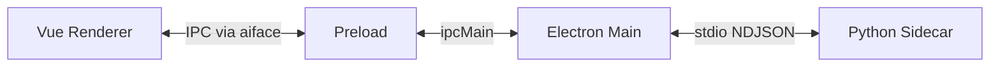

# AIFace 架构 Skill

## 运行时

## 目录

| 路径 | 职责 |
|------|------|
| `src/main/` | 窗口、IPC、`SidecarManager`、单实例、`before-quit` |
| `src/preload/` | `contextBridge` → `window.aiface` |
| `src/renderer/src/` | Vue、路由、Pinia、Dexie、i18n、页面 |
| `src/shared/` | IPC 常量、NDJSON 类型、`window` 类型 |
| `python_sidecar/` | Python 入口与 mock |
| `resources/` | `extraResources` 占位（模型/运行时） |

## 路由

- `/dashboard` — 硬件摘要 IPC 示例
- `/live` — 三栏：摄像头、参数、Sidecar 指标
- `/train` — Loss 图表示例（ECharts）
- `/assets/faces`、`/assets/models` — 占位
- `/settings` — 语言、显存水位、打开日志目录

## Dexie（v1）

- `table_tasks`：`id`, `config`, `status`, `lossSummary`, 时间戳
- `table_face_metadata`：路径、质量分、姿态、是否参与训练
- `table_presets`：名称、`params`（启动时种子「1080p 标准」）

## Pinia

- `hardware` — `GET_HARDWARE_SUMMARY`
- `live` — 预览与算法参数 UI 状态
- `sidecar` — 连接与 `lastMetrics`、订阅主进程推送
- `train` — Loss 点列表示例
- `settings` — `locale`、`antdLocale`、`vramWatermarkMb`

## 相关 Rules

- `aiface-core.mdc`、`aiface-electron-main.mdc`、`aiface-vue-renderer.mdc`、`aiface-sidecar-protocol`（Skill）
